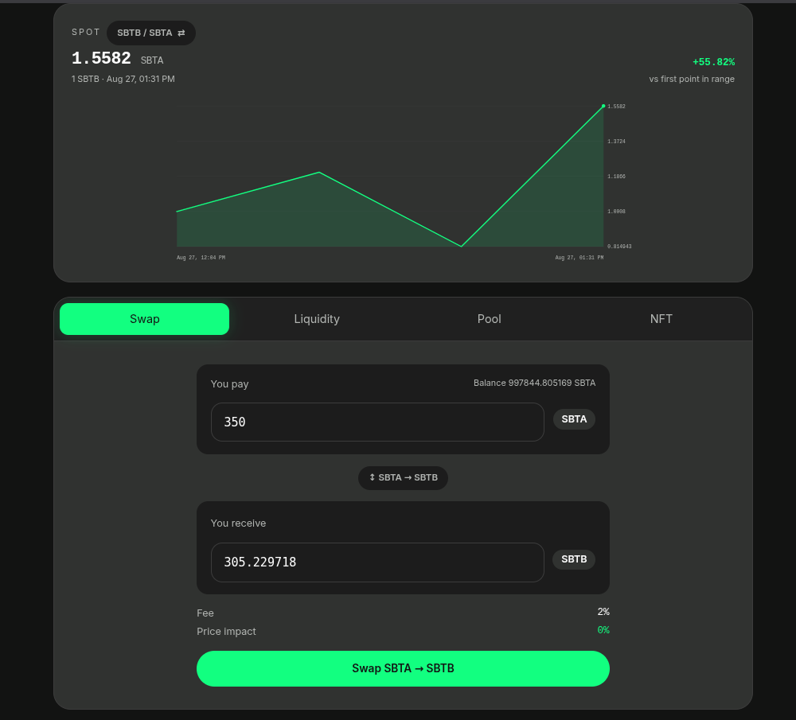
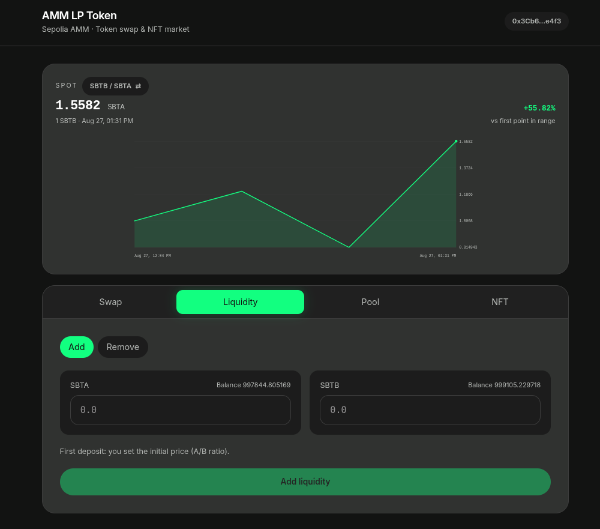
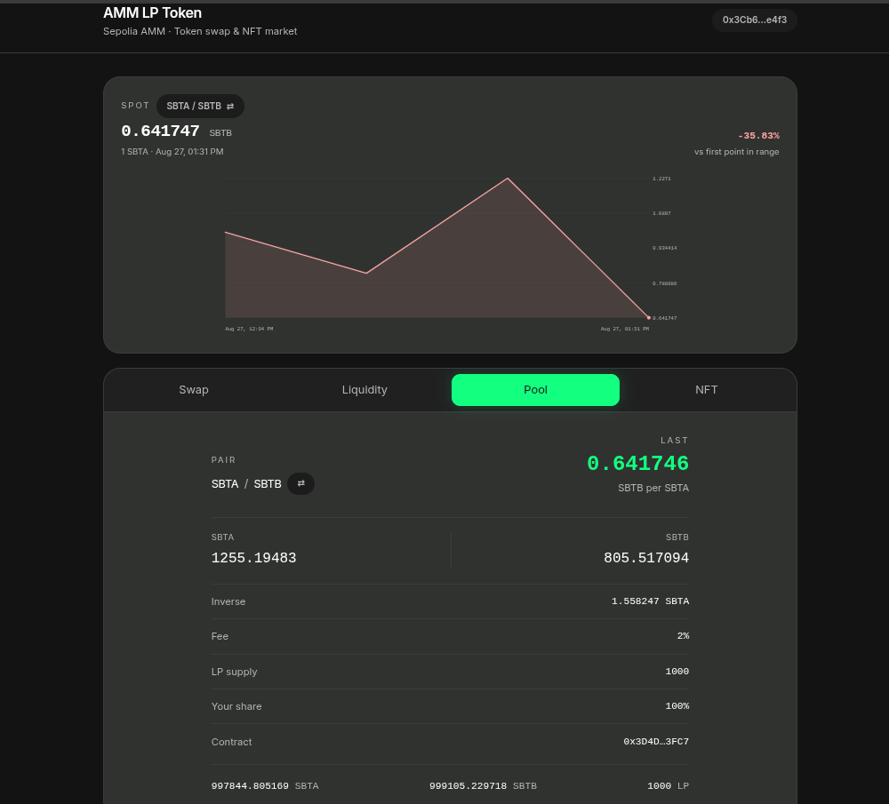
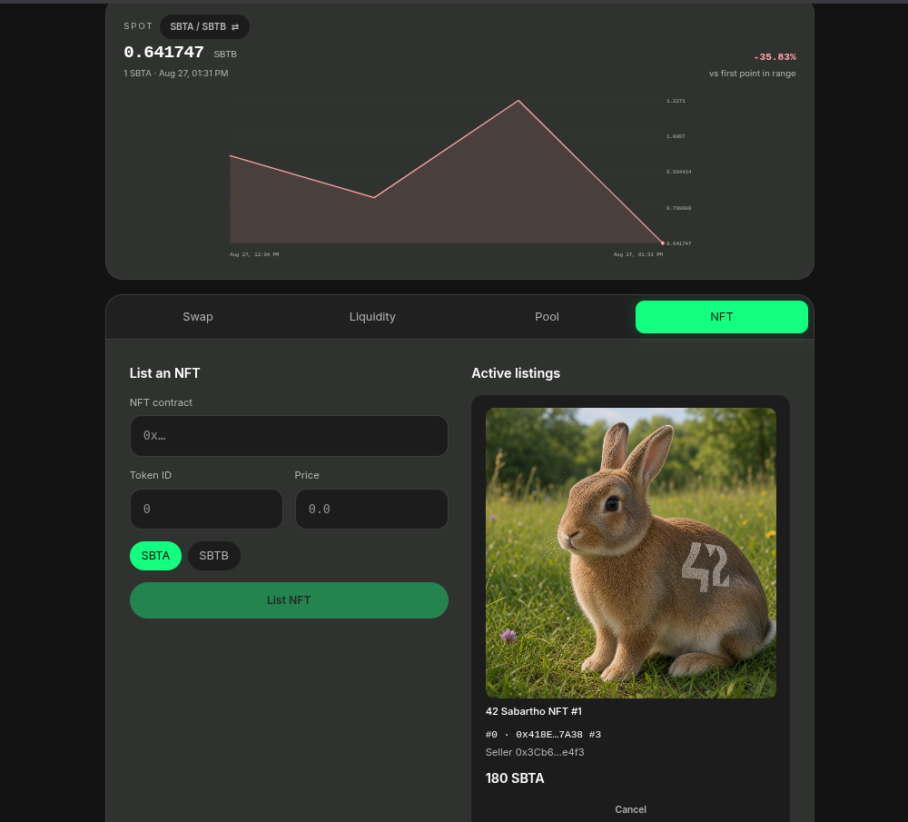
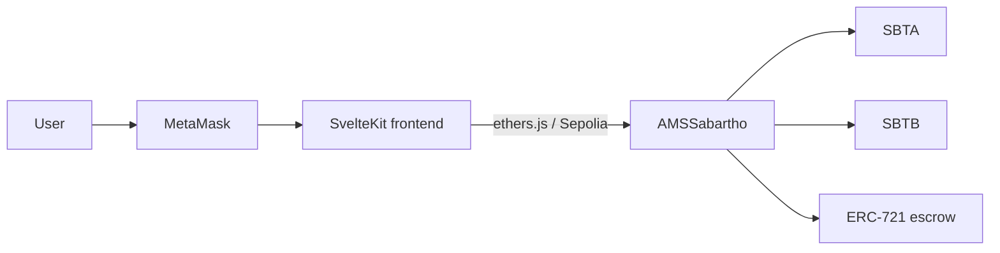

# TokenZwap — documentation (EN)

Decentralized exchange DApp on **Sepolia**: a constant-product AMM pool (SBTA / SBTB) and a fixed-price NFT marketplace, both in `AMSSabartho`.

| Document | Contents |
| --- | --- |
| [How to deploy and test](deploy-and-test.md) | Environment, Hardhat deploy, manual tests, DApp launch |
| [Contract explanations](contract-explanations.md) | Tokens, `x · y = k` pool, LP shares, NFT market |
| [Known limitations](limitations.md) | Residual sandwich, unbalanced liquidity, scaling |

DApp screenshots: [`../screenshots`](../screenshots)

## Deployed contracts (Sepolia)

| Contract | Symbol | Address |
| --- | --- | --- |
| `SabarthoTokenA` | SBTA | [`0xDe8AA58Ba90119a11bF5d571Afef6faEdcC98F38`](https://sepolia.etherscan.io/address/0xDe8AA58Ba90119a11bF5d571Afef6faEdcC98F38) |
| `SabarthoTokenB` | SBTB | [`0xBD06a1aa6eD26A7B8d5a13F2B208f813A802D184`](https://sepolia.etherscan.io/address/0xBD06a1aa6eD26A7B8d5a13F2B208f813A802D184) |
| `AMSSabartho` | AMMLP | [`0x5be75E6e0a1ab73F3E02355C1Cd2BB91D0cAc368`](https://sepolia.etherscan.io/address/0x5be75E6e0a1ab73F3E02355C1Cd2BB91D0cAc368) |

Pool fee at deploy: **2%**. Initial supply per token: **1,000,000** (18 decimals), minted to the deployer.

## DApp in action

SvelteKit UI (dark theme, green accent). Four tabs: Swap, Liquidity, Pool, NFT.

### Swap

Quote on-chain via `getAmountOut`, fee and price impact, max slippage (0.5% / 1% / 3%), then `approve` + `swap(..., minAmountOut, deadline)`. If the pool moves past **Min received**, the tx reverts `slippage too high`. The DApp sets `deadline` to **now + 20 min** so a stuck tx cannot be included much later.

### Liquidity

Deposit SBTA + SBTB (pool-ratio hint) or redeem AMMLP pro-rata.

### Pool

Reserves, spot price, LP supply, user share, contract address.

### NFT

List an ERC-721 (escrowed in the AMM) and buy it with SBTA or SBTB. Payment goes to the seller, not the pool.

## Architecture

