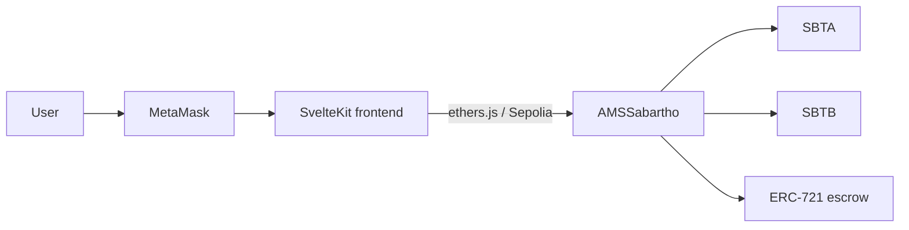

# TokenZwap — documentation (EN)

Decentralized exchange DApp on **Sepolia**: a constant-product AMM pool (SBTA / SBTB) and a fixed-price NFT marketplace, both in `AMSSabartho`.

| Document | Contents |
| --- | --- |
| [How to deploy and test](deploy-and-test.md) | Environment, Hardhat deploy, manual tests, DApp launch |
| [Contract explanations](contract-explanations.md) | Tokens, `x · y = k` pool, LP shares, NFT market |
| [Known limitations](limitations.md) | Fees, slippage, unbalanced liquidity, scaling |

## Deployed contracts (Sepolia)

| Contract | Symbol | Address |
| --- | --- | --- |
| `SabarthoTokenA` | SBTA | [`0xC736b5BC9C484f275E8B0E3B4e4eb174Ed3D94EB`](https://sepolia.etherscan.io/address/0xC736b5BC9C484f275E8B0E3B4e4eb174Ed3D94EB) |
| `SabarthoTokenB` | SBTB | [`0xC8e5d9A680d0edee5e42Ef8c10F3A3aBC8CD5C46`](https://sepolia.etherscan.io/address/0xC8e5d9A680d0edee5e42Ef8c10F3A3aBC8CD5C46) |
| `AMSSabartho` | AMMLP | [`0x2C525A01fC50864B110cb23cF600DEAEB9Be826a`](https://sepolia.etherscan.io/address/0x2C525A01fC50864B110cb23cF600DEAEB9Be826a) |

Pool fee at deploy: **2%**. Initial supply per token: **1,000,000** (18 decimals), minted to the deployer.

## DApp in action

SvelteKit UI (dark theme, green accent). Four tabs: Swap, Liquidity, Pool, NFT. The shots below match the live layout (labels, tabs, theme); amounts are demo values.

### Swap

On-chain quote via `getAmountOut`, fee and price impact, then `approve` + `swap`.

### Liquidity

Deposit SBTA + SBTB (pool-ratio hint) or redeem AMMLP pro-rata.

### Pool

Reserves, spot price, LP supply, user share, contract address.

### NFT

List an ERC-721 (escrowed in the AMM) and buy it with SBTA or SBTB. Payment goes to the seller, not the pool.

## Architecture

