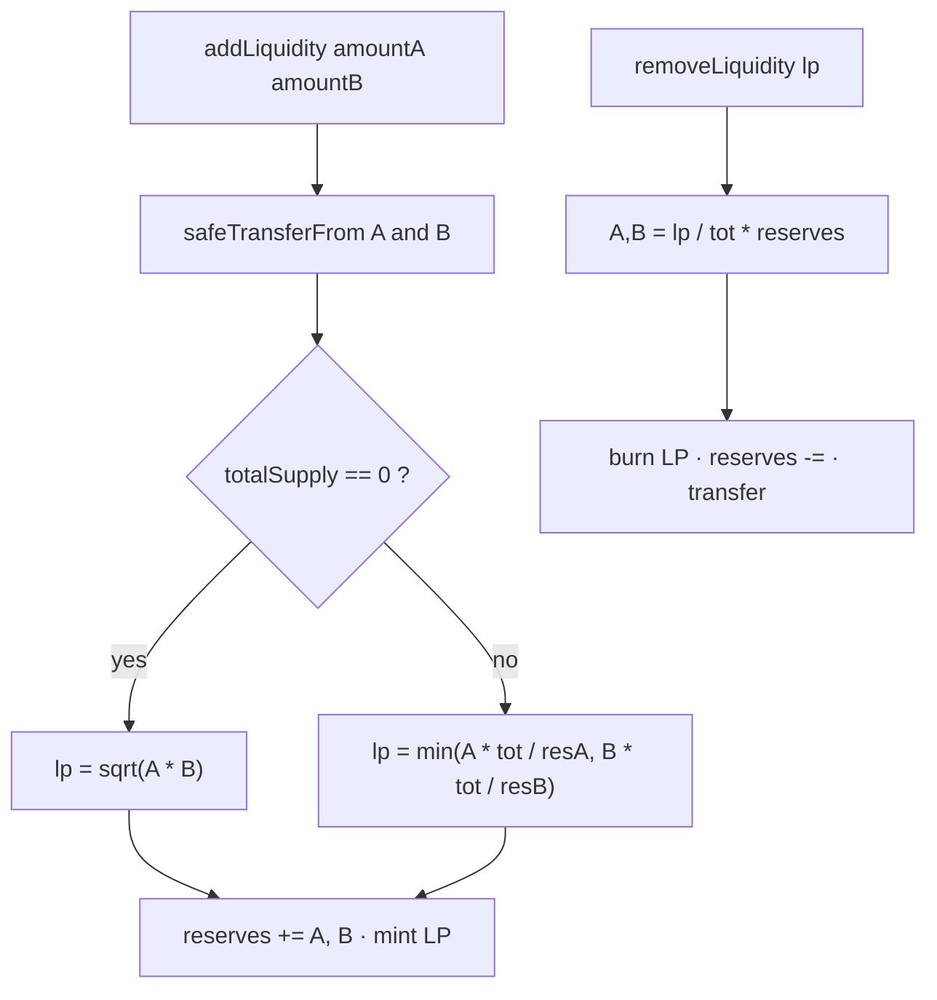

# Contract explanations

Three contracts: two teaching ERC-20s and one contract that is the **AMM vault**, the **LP token**, and the **NFT escrow**.


## 1. `SabarthoTokenA` / `SabarthoTokenB`

Files: `code/contracts/TokenASBT.sol`, `TokenBSBT.sol`.

OpenZeppelin ERC-20 + `Ownable`.

| | Token A | Token B |
| --- | --- | --- |
| Name | 42 Sabartho Token A | 42 Sabartho Token B |
| Symbol | SBTA | SBTB |
| Decimals | 18 | 18 |
| Sepolia address | `0xDe8AA58Ba90119a11bF5d571Afef6faEdcC98F38` | `0xBD06a1aa6eD26A7B8d5a13F2B208f813A802D184` |

**Constructor**: `initialSupply` in whole tokens (e.g. `1_000_000`). The contract mints `initialSupply * 10**18` to `msg.sender`, who becomes owner.

**`mint(to, amount)`**: `onlyOwner`. `amount` is in the smallest unit (token-wei), not human tokens.

They have no AMM logic. The AMM treats them as `IERC20` via `SafeERC20`.

## 2. `AMSSabartho` — overview

File: `code/contracts/AMM.sol`. Address: `0x5be75E6e0a1ab73F3E02355C1Cd2BB91D0cAc368`.

Inherits:

- `ERC20("AMM LP Token", "AMMLP")` — pool shares *are* this token
- `IERC721Receiver` — accepts NFT `safeTransferFrom`
- `ReentrancyGuard` — `nonReentrant` on every state-changing function
- `Ownable` — owner = deployer (no business `onlyOwner` function in this file)

Constructor: `(_tokenA, _tokenB, _feePercent)`

- tokens non-zero and distinct
- `feePercent` ∈ [1, 10]
- `tokenA` and `tokenB` are immutable; `feePercent` is public and never updated

Pool state: `reserveA`, `reserveB` (internal accounting, updated on deposit / withdraw / swap).

## 3. Liquidity




### `addLiquidity(amountA, amountB, deadline) → lpMinted`

1. `deadline >= block.timestamp`, otherwise revert `Deadline expired`.
2. Both amounts must be > 0.
3. The contract pulls A and B from the caller (`approve` required).
4. **First LP** (`totalSupply() == 0`): `lpMinted = sqrt(amountA * amountB)` (geometric mean, Babylonian `sqrt`). The A/B ratio **sets the price**.
5. **Later deposits**: mint the weaker of the two valuations so the depositor is never credited above the thin side:
   - `lpFromA = amountA * totalLP / reserveA`
   - `lpFromB = amountB * totalLP / reserveB`
6. **Both** amounts are added to reserves. Surplus on the strong side stays in the pool (no refund).
7. `_mint(msg.sender, lpMinted)` · event `LiquidityAdded`.

### `removeLiquidity(lpAmount, deadline) → (amountA, amountB)`

Pro-rata claim on both reserves:

```
amountA = lpAmount * reserveA / totalLP
amountB = lpAmount * reserveB / totalLP
```

Spot price is unchanged; `k = reserveA * reserveB` falls. Burn, then `safeTransfer` both tokens. Event `LiquidityRemoved`.

Swap fees sit in the reserves: every LP realizes a share when they exit.

## 4. Swap (constant product)


Model: **x · y = k**. Spot prices:

- 1 A in B = `reserveB / reserveA`
- 1 B in A = `reserveA / reserveB`

### `swap(tokenIn, amountIn, minAmountOut, deadline) → amountOut`

1. `deadline >= block.timestamp`, otherwise revert `Deadline expired`.
2. `tokenIn` must be A or B, `amountIn > 0`.
3. `safeTransferFrom` of `amountIn` into the pool.
4. Quote (same as `getAmountOut`):

```
inFee = amountIn * (100 - feePercent) / 100
amountOut = inFee * reserveOut / (reserveIn + inFee)
```

5. `amountOut` must be > 0 and strictly less than the output reserve.
6. **Slippage**: `amountOut >= minAmountOut`, otherwise revert `slippage too high`. The DApp sends `quoted * (10000 - slippageBps) / 10000` (default 1%).
7. The **full** `amountIn` is added to the input reserve; `amountOut` is subtracted from the output reserve. The 2% fee therefore stays in the pool (LP revenue).
8. Transfer the output token · event `Swapped`.

Together, `minAmountOut` + `deadline` are the basic MEV guards: a sandwich cannot push you below the floor, and a stuck tx dies after 20 minutes (DApp default). A sandwich that lands *just above* `minAmountOut` is still possible.

### Views

- `getReserves()` → `(reserveA, reserveB)`
- `getAmountOut(tokenIn, amountIn)` → same formula as `swap`, no state change

## 5. Fixed-price NFT marketplace


Independent from the AMM curve. The seller sets the price in SBTA or SBTB.

```solidity
struct Listing {
    address seller;
    address nftContract;
    uint256 tokenId;
    address paymentToken; // A or B only
    uint256 price;
    bool active;
}
```

`listings[id]`, `listingCount` (increments, never reused).

### `listNFT(nftContract, tokenId, paymentToken, price) → listingId`

- `price > 0`, `paymentToken` is A or B
- `ownerOf(tokenId) == msg.sender`
- `safeTransferFrom` seller → AMM (escrow)
- Store listing + event `NFTListed`

The caller must `approve` the AMM on the NFT contract.

### `buyNFT(listingId)`

- Listing active, buyer ≠ seller
- Listing deactivated **before** transfers (prevents a double buy)
- ERC-20: buyer → **seller** (not the pool)
- NFT: AMM → buyer
- Event `NFTPurchased`

### `cancelListing(listingId)`

Seller only. Listing inactive, NFT returned. Event `NFTListingCancelled`.

### `onERC721Received`

Returns the ERC-721 selector. Without it, `safeTransferFrom` into the AMM would revert.

## 6. Events

| Event | When |
| --- | --- |
| `LiquidityAdded` | deposit + LP mint |
| `LiquidityRemoved` | LP burn + withdrawals |
| `Swapped` | A↔B trade |
| `NFTListed` | new escrow |
| `NFTPurchased` | sale |
| `NFTListingCancelled` | seller cancel |

## 7. Frontend role

The DApp does not recompute the quote locally: it calls `getAmountOut`. It also:

- connects MetaMask / switches to Sepolia (`chainId` 11155111)
- `approve`s ERC-20 with `MaxUint256` when allowance is too low
- `approve`s the ERC-721 before `listNFT`
- suggests amount B (`amountA * reserveB / reserveA`)
- previews LP withdrawal
- computes a local price-impact hint (quote vs spot)
- loads listings `0 .. listingCount-1`
- resolves NFT media from `tokenURI` (IPFS gateways)
