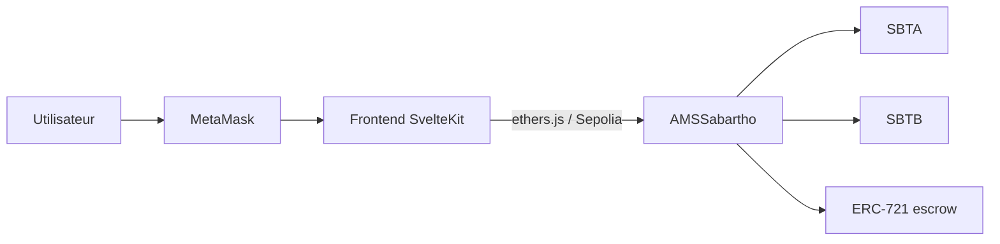

# TokenZwap — documentation (FR)

DApp d’échange décentralisé sur **Sepolia** : un pool AMM produit constant (SBTA / SBTB) et un marketplace NFT à prix fixe, le tout dans le contrat `AMSSabartho`.

| Document | Contenu |
| --- | --- |
| [Déployer et tester](deploiement-et-tests.md) | Environnement, déploiement Hardhat, tests manuels, lancement de la DApp |
| [Explication des contrats](explication-contrats.md) | Tokens, pool `x · y = k`, LP, marketplace NFT |
| [Limites connues](limites.md) | Frais, slippage, liquidité déséquilibrée, scaling |

Diagrammes : [`../diagrams`](../diagrams) · Captures DApp : [`../screenshots`](../screenshots)

## Contrats déployés (Sepolia)

| Contrat | Symbole | Adresse |
| --- | --- | --- |
| `SabarthoTokenA` | SBTA | [`0xC736b5BC9C484f275E8B0E3B4e4eb174Ed3D94EB`](https://sepolia.etherscan.io/address/0xC736b5BC9C484f275E8B0E3B4e4eb174Ed3D94EB) |
| `SabarthoTokenB` | SBTB | [`0xC8e5d9A680d0edee5e42Ef8c10F3A3aBC8CD5C46`](https://sepolia.etherscan.io/address/0xC8e5d9A680d0edee5e42Ef8c10F3A3aBC8CD5C46) |
| `AMSSabartho` | AMMLP | [`0x2C525A01fC50864B110cb23cF600DEAEB9Be826a`](https://sepolia.etherscan.io/address/0x2C525A01fC50864B110cb23cF600DEAEB9Be826a) |

Frais du pool au déploiement : **2 %**. Supply initial de chaque token : **1 000 000** (18 décimales), minté au déployeur.

## La DApp en action

Interface SvelteKit (thème sombre, accent vert). Quatre onglets : Swap, Liquidity, Pool, NFT. Les visuels ci-dessous reproduisent le layout réel (labels, onglets, thème) ; les montants sont des exemples de démonstration.

### Swap

Quote on-chain via `getAmountOut`, affichage des frais et de l’impact prix, puis `approve` + `swap`.

### Liquidity

Dépôt SBTA + SBTB (suggestion du ratio du pool) ou retrait proportionnel d’AMMLP.

### Pool

Réserves, prix spot, supply LP, part de l’utilisateur, adresse du contrat.

### NFT

Mise en vente d’un ERC-721 (escrow dans l’AMM) et achat en SBTA ou SBTB. Les fonds vont au vendeur, pas dans le pool.

## Architecture

