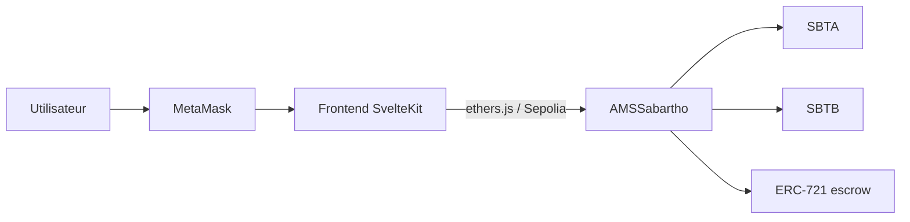

# TokenZwap — documentation (FR)

DApp d’échange décentralisé sur **Sepolia** : un pool AMM produit constant (SBTA / SBTB) et un marketplace NFT à prix fixe, le tout dans le contrat `AMSSabartho`.

| Document                                            | Contenu                                                                 |
| --------------------------------------------------- | ----------------------------------------------------------------------- |
| [Déployer et tester](deploiement-et-tests.md)       | Environnement, déploiement Hardhat, tests manuels, lancement de la DApp |
| [Explication des contrats](explication-contrats.md) | Tokens, pool `x · y = k`, LP, marketplace NFT                           |
| [Limites connues](limites.md)                       | Sandwich résiduel, liquidité déséquilibrée, scaling                     |

Captures DApp : `[../screenshots/](../screenshots)`

## Contrats déployés (Sepolia)

| Contrat          | Symbole | Adresse                                                                                                                         |
| ---------------- | ------- | ------------------------------------------------------------------------------------------------------------------------------- |
| `SabarthoTokenA` | SBTA    | `[0xDe8AA58Ba90119a11bF5d571Afef6faEdcC98F38](https://sepolia.etherscan.io/address/0xDe8AA58Ba90119a11bF5d571Afef6faEdcC98F38)` |
| `SabarthoTokenB` | SBTB    | `[0xBD06a1aa6eD26A7B8d5a13F2B208f813A802D184](https://sepolia.etherscan.io/address/0xBD06a1aa6eD26A7B8d5a13F2B208f813A802D184)` |
| `AMSSabartho`    | AMMLP   | `[0x5be75E6e0a1ab73F3E02355C1Cd2BB91D0cAc368](https://sepolia.etherscan.io/address/0x5be75E6e0a1ab73F3E02355C1Cd2BB91D0cAc368)` |

Frais du pool au déploiement : **2 %**. Supply initial de chaque token : **1 000 000** (18 décimales), minté au déployeur.

## La DApp en action

Interface SvelteKit (thème sombre, accent vert). Quatre onglets : Swap, Liquidity, Pool, NFT.

### Swap

Quote on-chain via `getAmountOut`, affichage des frais, de l’impact prix et du **slippage max** (0,5 % / 1 % / 3 %), puis `approve` + `swap(..., minAmountOut, deadline)`. Si le pool bouge au-delà de **Min received**, la tx revert `slippage too high`. La DApp envoie `deadline = now + 20 min` pour qu’une tx coincée ne puisse plus s’exécuter longtemps après.

Onglet Swap

### Liquidity

Dépôt SBTA + SBTB (suggestion du ratio du pool) ou retrait proportionnel d’AMMLP.

Onglet Liquidity

### Pool

Réserves, prix spot, supply LP, part de l’utilisateur, adresse du contrat.

Onglet Pool

### NFT

Mise en vente d’un ERC-721 (escrow dans l’AMM) et achat en SBTA ou SBTB. Les fonds vont au vendeur, pas dans le pool.

Onglet NFT

## Architecture

