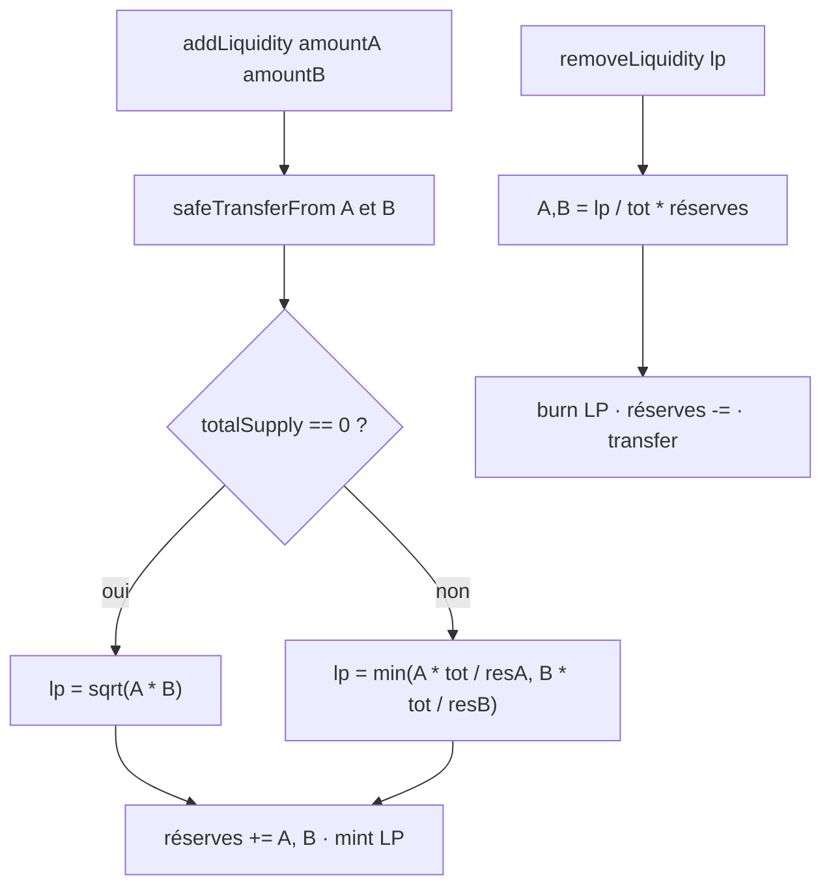

# Explication des contrats

Trois contrats : deux ERC-20 pédagogiques et un contrat unique qui est à la fois le **vault AMM**, le **token LP** et l’**escrow NFT**.


## 1. `SabarthoTokenA` / `SabarthoTokenB`

Fichiers : `code/contracts/TokenASBT.sol`, `TokenBSBT.sol`.

ERC-20 OpenZeppelin + `Ownable`.

| | Token A | Token B |
| --- | --- | --- |
| Nom | 42 Sabartho Token A | 42 Sabartho Token B |
| Symbole | SBTA | SBTB |
| Décimales | 18 | 18 |
| Adresse Sepolia | `0xDe8AA58Ba90119a11bF5d571Afef6faEdcC98F38` | `0xBD06a1aa6eD26A7B8d5a13F2B208f813A802D184` |

**Constructeur** : `initialSupply` en unités humaines (ex. `1_000_000`). Le contrat mint `initialSupply * 10**18` à `msg.sender`, qui devient owner.

**`mint(to, amount)`** : `onlyOwner`. `amount` est en plus petite unité (wei-token), pas en tokens « humains ».

Ils n’ont aucune logique AMM. L’AMM les traite comme des `IERC20` via `SafeERC20`.

## 2. `AMSSabartho` — vue d’ensemble

Fichier : `code/contracts/AMM.sol`. Adresse : `0x5be75E6e0a1ab73F3E02355C1Cd2BB91D0cAc368`.

Héritages :

- `ERC20("AMM LP Token", "AMMLP")` — les parts de pool sont le token lui-même
- `IERC721Receiver` — accepte les `safeTransferFrom` NFT
- `ReentrancyGuard` — `nonReentrant` sur toutes les fonctions d’état
- `Ownable` — owner = déployeur (pas de fonction métier `onlyOwner` dans ce fichier)

Constructeur : `(_tokenA, _tokenB, _feePercent)`

- tokens non nuls et distincts
- `feePercent` ∈ [1, 10]
- `tokenA`, `tokenB`, `feePercent` sont **immuables** après déploiement (le fee est un `uint256` public non-immutable, mais rien ne le met à jour)

État du pool : `reserveA`, `reserveB` (comptabilité interne, mise à jour à chaque dépôt / retrait / swap).

## 3. Liquidité




### `addLiquidity(amountA, amountB, deadline) → lpMinted`

1. `deadline >= block.timestamp`, sinon revert `Deadline expired`.
2. Les deux montants doivent être > 0.
3. Le contrat tire A et B chez l’appelant (`approve` obligatoire).
4. **Premier LP** (`totalSupply() == 0`) : `lpMinted = sqrt(amountA * amountB)` (moyenne géométrique, méthode babylonienne). Le ratio A/B **fixe le prix**.
5. **Dépôts suivants** : on mint le minimum des deux valorisations, pour ne jamais créditer plus que le côté faible :
   - `lpFromA = amountA * totalLP / reserveA`
   - `lpFromB = amountB * totalLP / reserveB`
6. Les **deux** montants sont ajoutés aux réserves. L’excédent du côté fort reste dans le pool (pas de refund).
7. `_mint(msg.sender, lpMinted)` · event `LiquidityAdded`.

### `removeLiquidity(lpAmount, deadline) → (amountA, amountB)`

Part proportionnelle des deux réserves :

```
amountA = lpAmount * reserveA / totalLP
amountB = lpAmount * reserveB / totalLP
```

Le prix spot ne change pas ; `k = reserveA * reserveB` diminue. Burn puis `safeTransfer` des deux tokens. Event `LiquidityRemoved`.

Les frais de swap restent dans les réserves : chaque LP en récupère une part à la sortie.

## 4. Swap (produit constant)


Modèle : **x · y = k**. Prix spot :

- 1 A en B = `reserveB / reserveA`
- 1 B en A = `reserveA / reserveB`

### `swap(tokenIn, amountIn, minAmountOut, deadline) → amountOut`

1. `deadline >= block.timestamp`, sinon revert `Deadline expired`.
2. `tokenIn` doit être A ou B, `amountIn > 0`.
3. `safeTransferFrom` de `amountIn` vers le pool.
4. Quote (identique à `getAmountOut`) :

```
inFee = amountIn * (100 - feePercent) / 100
amountOut = inFee * reserveOut / (reserveIn + inFee)
```

5. `amountOut` doit être > 0 et strictement inférieur à la réserve de sortie.
6. **Slippage** : `amountOut >= minAmountOut`, sinon revert `slippage too high`. La DApp envoie `quoted * (10000 - slippageBps) / 10000` (défaut 1 %).
7. **Tout** `amountIn` est ajouté à la réserve d’entrée ; `amountOut` est retiré de la réserve de sortie. Les 2 % de frais restent donc dans le pool (revenu LP).
8. Transfert du token de sortie · event `Swapped`.

`minAmountOut` + `deadline` sont les gardes MEV de base : un sandwich ne peut pas t’envoyer sous le plancher, et une tx coincée meurt au bout de 20 min (défaut DApp). Un sandwich qui atterrit *juste au-dessus* de `minAmountOut` reste possible.

### Vues

- `getReserves()` → `(reserveA, reserveB)`
- `getAmountOut(tokenIn, amountIn)` → même formule que le swap, sans bouger d’état

## 5. Marketplace NFT à prix fixe


Indépendant de la courbe AMM. Le vendeur fixe le prix en SBTA ou SBTB.

```solidity
struct Listing {
    address seller;
    address nftContract;
    uint256 tokenId;
    address paymentToken; // A ou B uniquement
    uint256 price;
    bool active;
}
```

`listings[id]`, `listingCount` (incrémenté, jamais réutilisé).

### `listNFT(nftContract, tokenId, paymentToken, price) → listingId`

- `price > 0`, `paymentToken` = A ou B
- `ownerOf(tokenId) == msg.sender`
- `safeTransferFrom` vendeur → AMM (escrow)
- Enregistrement + event `NFTListed`

L’appelant doit `approve` le contrat AMM sur le NFT.

### `buyNFT(listingId)`

- Listing active, acheteur ≠ vendeur
- Listing désactivée **avant** les transferts (évite un double achat)
- ERC-20 : acheteur → **vendeur** (pas le pool)
- NFT : AMM → acheteur
- Event `NFTPurchased`

### `cancelListing(listingId)`

Vendeur uniquement. Listing inactive, NFT rendu. Event `NFTListingCancelled`.

### `onERC721Received`

Renvoie le sélecteur ERC-721. Sans ça, `safeTransferFrom` vers l’AMM revert.

## 6. Événements

| Event | Quand |
| --- | --- |
| `LiquidityAdded` | dépôt + mint LP |
| `LiquidityRemoved` | burn LP + retraits |
| `Swapped` | échange A↔B |
| `NFTListed` | nouvel escrow |
| `NFTPurchased` | vente |
| `NFTListingCancelled` | annulation vendeur |

## 7. Rôle du frontend

La DApp ne recalcule pas le quote : elle appelle `getAmountOut`. Elle gère :

- connexion MetaMask / switch Sepolia (`chainId` 11155111)
- `approve` ERC-20 en `MaxUint256` si l’allowance est trop basse
- `approve` ERC-721 avant `listNFT`
- suggestion du montant B (`amountA * reserveB / reserveA`)
- prévisualisation du retrait LP
- impact prix local (écart quote vs prix spot)
- chargement des listings `0 .. listingCount-1`
- médias NFT via `tokenURI` (gateways IPFS)
